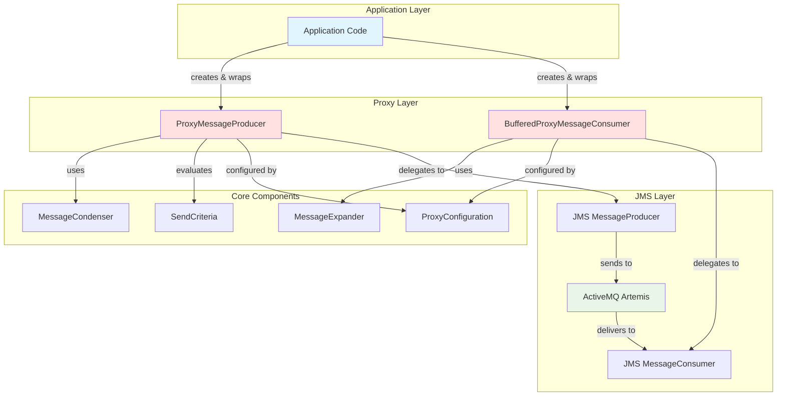
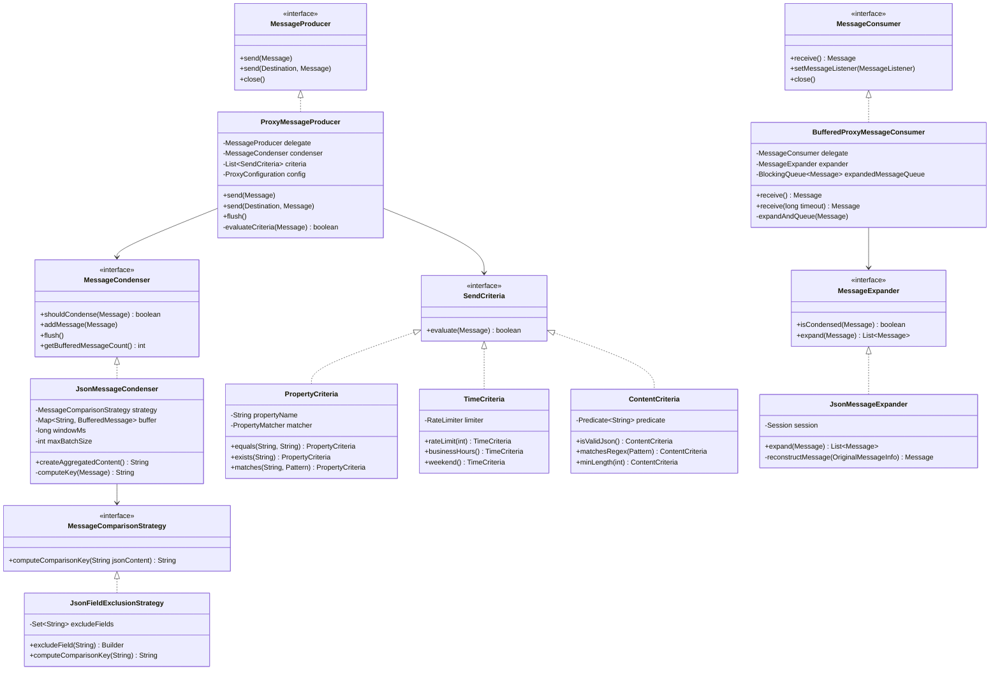
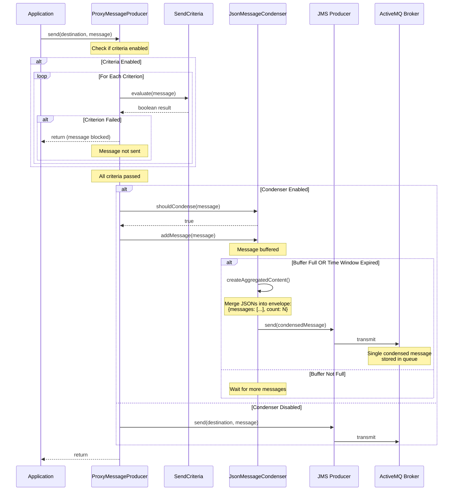
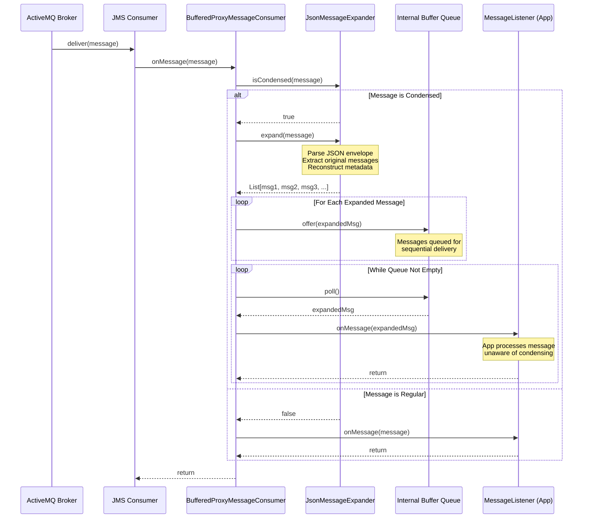
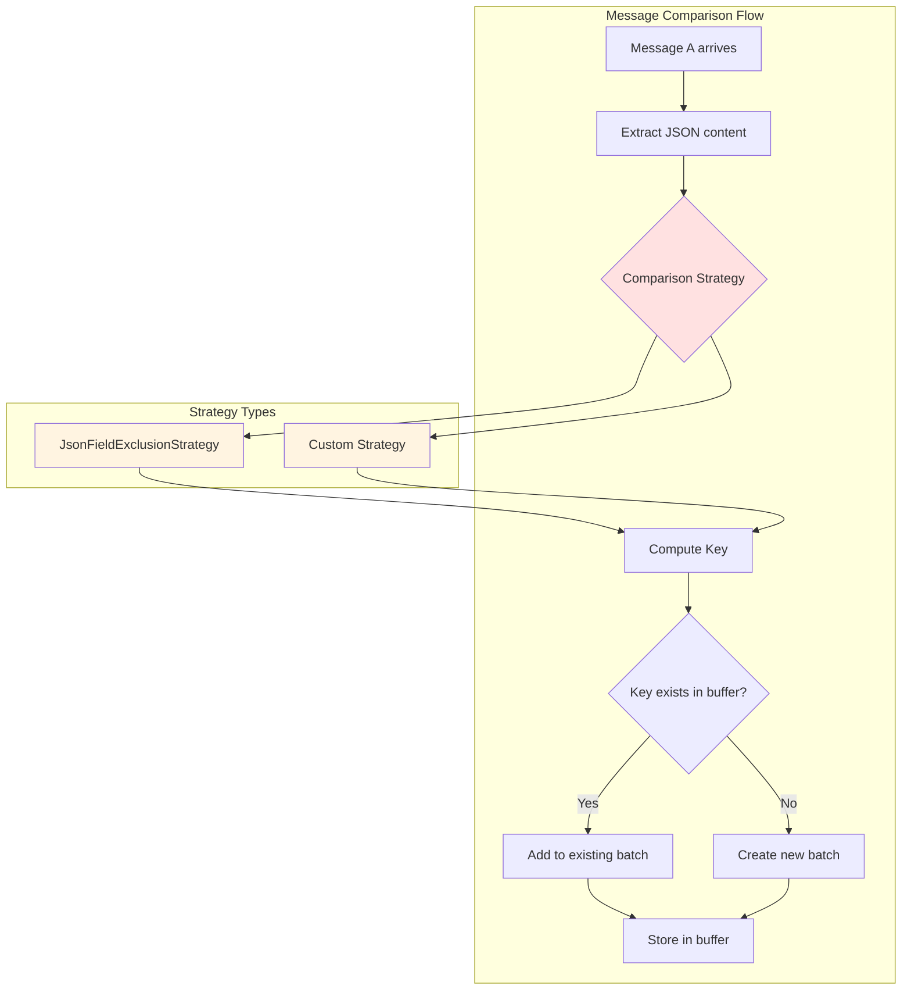
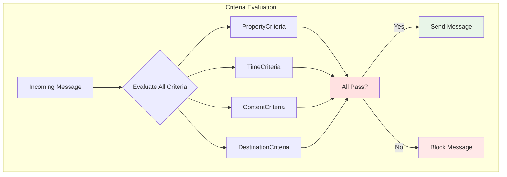
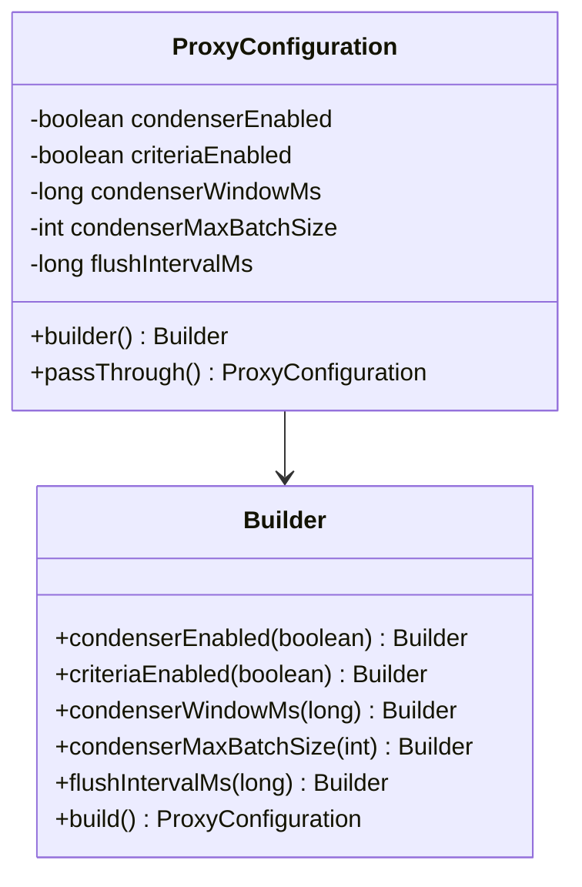
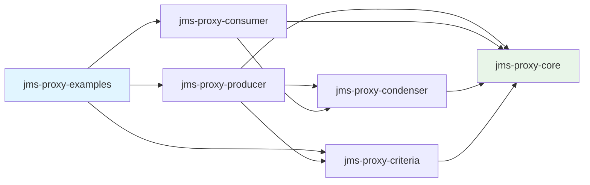

# JMS Proxy Framework - Architecture Documentation

This document provides detailed architecture diagrams and technical explanations for the JMS Proxy Framework.

## Table of Contents

1. [Component Overview](#component-overview)
2. [Class Structure](#class-structure)
3. [Producer Flow](#producer-flow)
4. [Consumer Flow](#consumer-flow)
5. [Condensing Strategy](#condensing-strategy)
6. [Criteria System](#criteria-system)

---

## Component Overview

The JMS Proxy Framework consists of several modules that work together to provide transparent message proxying, condensing, and filtering.



---

## Class Structure

This diagram shows the main classes and their relationships within the framework.



---

## Producer Flow

This sequence diagram illustrates what happens when an application sends a message through the `ProxyMessageProducer`.



**Key Points:**
1. **Criteria Evaluation**: Messages are checked against all registered criteria before processing.
2. **Buffering**: If condensing is enabled, messages are buffered until the time window expires or batch size is reached.
3. **Aggregation**: Multiple messages are merged into a single JSON envelope with metadata about the originals.
4. **Flushing**: A background scheduler periodically flushes the condenser to prevent messages from being held indefinitely.

---

## Consumer Flow

This sequence diagram shows how the `BufferedProxyMessageConsumer` handles incoming messages, including automatic expansion of condensed messages.



**Key Points:**
1. **Detection**: The expander checks if a message is condensed by looking for specific properties or structure.
2. **Expansion**: Condensed messages are unpacked into their original individual messages.
3. **Buffering**: Expanded messages are queued to ensure sequential delivery.
4. **Transparency**: The application's `MessageListener` receives individual messages, completely unaware of the batching.

---

## Condensing Strategy

The condensing mechanism uses a sophisticated comparison strategy to group similar messages together.



**Example: Field Exclusion Strategy**

```java
// Configure to ignore timestamp and eventId when comparing messages
JsonMessageCondenser condenser = JsonMessageCondenser.builder()
    .comparisonStrategy(
        JsonFieldExclusionStrategy.builder()
            .excludeField("timestamp")
            .excludeField("eventId")
            .build()
    )
    .windowMs(2000)
    .maxBatchSize(10)
    .build();
```

**How it works:**
1. Two messages with content `{"user": "john", "timestamp": "2025-12-08T10:00:00"}` and `{"user": "john", "timestamp": "2025-12-08T10:00:05"}` will be considered "similar" because the `timestamp` field is excluded.
2. They will be batched together into a single condensed message.
3. The condensed message contains both originals in a JSON array.

---

## Criteria System

The criteria system provides a flexible way to filter messages before they are sent. Multiple criteria can be combined using logical operators.



**Available Criteria Types:**

1. **PropertyCriteria**: Filter based on message properties
   ```java
   PropertyCriteria.equals("isValid", "true")
   PropertyCriteria.exists("userId")
   PropertyCriteria.matches("email", Pattern.compile(".*@example\\.com"))
   ```

2. **TimeCriteria**: Filter based on time constraints
   ```java
   TimeCriteria.rateLimit(100)  // Max 100 messages per second
   TimeCriteria.businessHours()  // Only 9 AM - 5 PM
   TimeCriteria.weekend()        // Only weekends
   ```

3. **ContentCriteria**: Filter based on message content
   ```java
   ContentCriteria.isValidJson()
   ContentCriteria.matchesRegex(Pattern.compile(".*error.*"))
   ContentCriteria.minLength(10)
   ```

4. **CompositeCriteria**: Combine multiple criteria
   ```java
   CompositeCriteria.allOf(
       PropertyCriteria.equals("type", "order"),
       ContentCriteria.isValidJson(),
       TimeCriteria.businessHours()
   )
   ```

**Example: Complex Filtering**

```java
MessageProducer producer = ProxyMessageProducer.builder(rawProducer, session)
    .addCriteria(
        CompositeCriteria.allOf(
            PropertyCriteria.equals("priority", "high"),
            TimeCriteria.rateLimit(50),
            ContentCriteria.minLength(100)
        )
    )
    .build();
```

This configuration will:
- Only send messages where `priority` property is "high"
- Limit to 50 messages per second
- Require content length of at least 100 characters

---

## Configuration

The `ProxyConfiguration` class provides centralized control over proxy behavior:



**Example Configurations:**

```java
// Default configuration: Condensing and criteria enabled
ProxyConfiguration config = ProxyConfiguration.builder().build();

// Pass-through mode: No condensing, no criteria
ProxyConfiguration config = ProxyConfiguration.passThrough();

// Custom configuration
ProxyConfiguration config = ProxyConfiguration.builder()
    .condenserEnabled(true)
    .condenserWindowMs(5000)      // 5 second window
    .condenserMaxBatchSize(50)    // Max 50 messages per batch
    .criteriaEnabled(true)
    .flushIntervalMs(1000)        // Flush every second
    .build();
```

---

## Module Dependencies



**Dependency Rationale:**
- **jms-proxy-core**: Foundation module with interfaces and shared utilities
- **jms-proxy-condenser**: Implements message aggregation strategies
- **jms-proxy-criteria**: Pre-built filtering criteria
- **jms-proxy-producer**: Producer proxy implementation
- **jms-proxy-consumer**: Consumer proxy implementation
- **jms-proxy-examples**: Demo applications and integration tests
